# Project 1: Design Journey

**For each milestone, complete only the sections that are labeled with that milestone.**

**Replace ALL _TODOs_ with your work.** (There should be no TODOs in the final submission.)

Be clear and concise in your writing. Bullets points are encouraged.

**Everything, including images, must be visible in Markdown Preview.** If it's not visible in Markdown Preview, then we won't grade it. We won't give you partial credit either. This is your warning.

## Personal Website Design Exploration (Milestone 1)

Identify three personal websites that exist today on the web. Include a screenshot of the home page for each site. **We'll refer to these are your "example websites."**

1. <TODO>

    

    <!-- Source: https://jonochshorn.com/index.html -->

2. <TODO>

    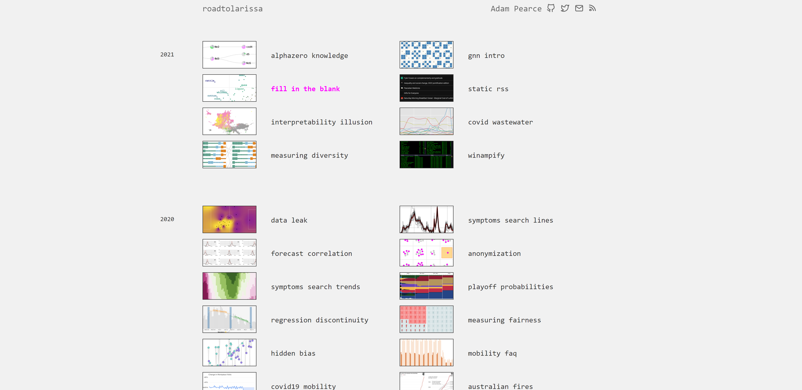
    <!-- Source: https://roadtolarissa.com/ -->

3. <TODO>

    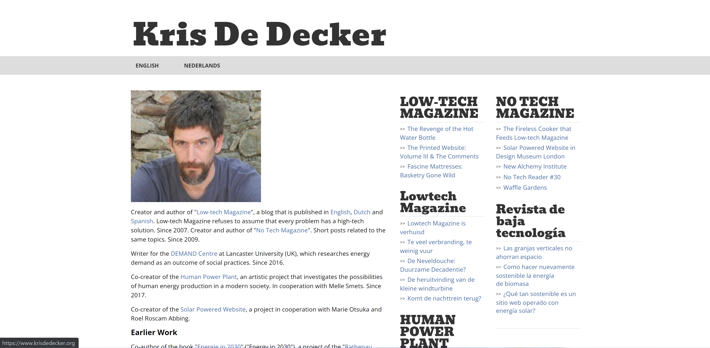

    <!-- Source: https://www.krisdedecker.org/ -->

### Personal Website 1 Review (Milestone 1)
> Review the personal website you identified above. (1 paragraph)
> Who do you think this site is designed for? Who is its intended target audience?
> What do you like about the design?
> What could be improved about the design?

This site is designed for both potential employers, as well as students who are seeking more information about the author's body of work. Links to the author's CV, as well as to his portfolio, writings, and course information are clearly laid out and navigable from the home page.

I personally like that the homepage is kept simple and laid out in a clear hierarchy. Content is clearly categorized and put in one row, followed by a row of recent updates, and finally a separated row showing the author's published books. This is all immediately visible when the site is loaded, and there is almost no need to scroll.

Apart from text styling and images, any sort of styling is kept to a minimum. All of the text is a clear sans serif with different styles to denote a hierarchy.

There's a lot of unused space to the right when viewed from a widescreen laptop in a browser. Although it isn't visible in vertically-oriented views, in horizontal views it creates a lot of emptiness. I'm wondering if it would make sense to load any extra content here, although at present it seems like there is enough being displayed.

### Personal Website 2 Review (Milestone 1)
> Review the personal website you identified above. (1 paragraph)
> Who do you think this site is designed for? Who is its intended target audience?
> What do you like about the design?
> What could be improved about the design?

I believe this site is designed for potential employers looking for someone to develop toolkits, or to visualize charts, or to make those charts interactive. The author's body of work is clearly laid out in such a way that an employer gets a sense of their capabilities.

The author's work is immediately laid out and separated by year. Each entry is titled, and accompanied by a photo as a visual aid. There's an automatic sense of continuity, so I can tell right away which project precedes which other one.

I also like that styling is kept at a minimum to the background color and text. The pink serves as a nice contrast to the rest of the black-colored text and effectively highlights certain projects.

I do think the website could add a link to an about page, or implement it within the index.html somehow.

### Personal Website 3 Review (Milestone 1)
> Review the personal website you identified above. (1 paragraph)
> Who do you think this site is designed for? Who is its intended target audience?
> What do you like about the design?
> What could be improved about the design?

I think this website is designed for readers of the magazine that this author created, who want to know the person behind it better. The website indicates that the author has held many workshops and talks at university conferences, implying that the target audience could also be educators and students specifically.

I personally like that there is a nav bar that includes an option for multiple languages. It makes it easier for people who speak one or the other to navigate, and also expands the audience to people fluent in these languages.

I think something that can be improved about the design is giving more options for the nav bar. I think a lot of emphasis is placed on it (being a gray bar) and that this can be leveraged beyond only including language functionalities.

## Personal Site & Audience (Milestone 1)

### Website Topic (Milestone 1)
> Briefly explain what your website will be about. Share your vision of your personal website.

My website will showcase my work in art, graphic design, digital marketing, motion graphics, and architecture. It will also include a resume, as well as a blog about my views on certain topics related to the work I am displaying.

### Audience (Milestone 1)
> Briefly explain who the intended audience(s) is for your website. Be specific and justify why this audience is appropriate for your site's topic.

The intended audience for my website are potential employers in any design field, whether it's architecture, marketing, or art. They will have more of an insight not only of my work, but also my rationales as to why I design things the way I do through my blog. Finally, they will have immediate access to my resume, so my work experience is succinctly noted.

My intended audience may also be any of my peers who want deeper insights into my work. They are important for making networks with, as well as for exchanging ideas with. I believe my blog will especially help facilitate this exchange.

## Content Planning (Milestone 1)

Plan your site's content.

### Example Websites Content Review (Milestone 1)
> For each of your 3 example websites, identify the content on each site.
> List each piece of content for each site using a summary of the content.

Example Site 1:
- title of website (jonochshorn.com)

- about
  - includes links to resumes, a photo biography, and contact information. denoted with a headshot)
- academics
  - includes information about courses, as well as a specification of office hours.
- scholarship
  - links to:
    - writings
    - videos
    - structural calculators
    - building technology calculators
- art and design
  - links to:
    - architectural works completed by the author
    - furniture designed by the author
    - flip books drawn by the author
    - recipes for pizza made by the author
    - tee shirts designed by the author
    - poetry written by the author
- music
  - links to:
    - original songs and covers
    - Rollo (a band the author is part of)
- social media
  - links to:
    - embedded twitter follow link
    - twitter handle
    - author's own blog
- "What's New?" Heading
  - lists most recent updates posted to website
- Books published by the author
  - Structural Elements for architects and builders
  - Building Bad

Example Site 2:
- header
  - justified left: website title (roadtolarissa)
  - justified right: author's name, followed by icons acting as links to social media accounts
- single column of works, with years spaced apart to create their own sections

Example Site 3:
- website heading (Kris De Decker)
- nav bar:
  - english version of site
  - netherlands version of site
- headshot
- general summary of author's work, including major projects, current occupation, and creator credentials
- earlier work (separated from general info as a heading)
  - includes body of work from less recent time periods, starting from 2011 going back to 1996
- Talks and Workshops (separated as a heading)
  - chronological (present to past) list of seminars and workshops hosted by the author
- contact information
- select photos with captions, showcasing most important workshops
- aside, includes links to:
  - magazine
  - magazine (in dutch)
  - blog writings

### Your Site's Planned Content (Milestone 1)
> List the content you plan to include your personal website.

- resume
- architecture portfolio
- graphic design portfolio
- digital marketing portfolio
- motion graphics portfolio
- art portfolio
- miscellaneous, experimental projects
- blog
- about page
- contact

### Content Justification (Milestone 1)
> Explain (about a paragraph) why this content is the right content for your site's intended audience.

I intend to utilize my site to reach a broad audience across possible design professions I would be interested in pursuing after college. By separating my site into several portfolios, I can effectively direct any visitors to whichever body of work is most relevant to their field. Since there is overlap in the work required across the fields I am familiar in (for example: architects need to be familiar with drafting and Adobe InDesign for documentation) a visitor will be able to see I have a deeper proficiency and understanding of them, both in and out of the context of a particular field. Ultimately, these different portfolios exist to show that my skills in multiple fields are an asset to any one particular job. My miscellaneous portfolio section shows my willingness and ability to combine particular fields to create new forms of expression.

A resume and about page provide more condensed explanations on my body of work, my guiding design philosophies, and how my interests play a part in it.

### Home Page Content (Milestone 1)
> Briefly identify what content you will include on the homepage and why this content should be the first thing your target audience sees when they visit your site.

- Links to:
  - about (headshot of me on top)
    - contact
    - who I am
    - resume
  - architecture portfolio (example of my work on top)
  - graphic design portfolio (example of my work on top)
  - digital marketing portfolio (example of my work on top)
  - motion graphics portfolio (example of my work on top)
  - art portfolio (example of my work on top)
  - miscellaneous, experimental projects (example of my work on top)
  - blog
    - corresponding image icon for each bullet, with each sub bullet being listed underneath without an icon

## Information Architecture (Milestone 2)

### Content Organization (Milestone 2)
> Document your iterations of card sorting here.
> Include photographic evidence of each iteration of card sorting and description of your thought process for each iteration.

First Card Sort:

I first sorted each piece of "content" into categories, expressed in columns from left to right:
- Resume
- Blog
- Animations
- Architecture
- Graphic Design
- Art Pieces
- Miscellaneous Projects

Second Card Sort:

My second pass through card sorting maintained the same column-categories, but I further split each one into chunks in a way that was useful for the content being grouped. For example, I grouped "college savings video," "me at Cornell video," and "cart video" together since they are all part of the same video that I uploaded onto YouTube.

### Final Content Organization (Milestone 2)
> Which iteration of card sorting will you use for your website?

I will be using this second iteration to inform how I divide my website.

> Explain how the final organization of content is appropriate for your site's audiences.

This final organization splits my work into distinct categories in a way such that anyone coming from any of the design backgrounds relative to my work know where to look for one type of work, if I have it.

### Navigation (Milestone 2)
> Please list the pages you will include in your personal website navigation.

- Resume
- Blog
- Animations
- Architecture
- Graphic Design
- Art
- Miscellaneous Projects

> Explain why the names of these pages make sense for your site's audience.

TODO

## Visual Themes (Milestone 3)

**Make the case for your decisions using concepts from class, as well as other design principles, theories, examples, and cases from outside of class.**

Remember to focus on the things we can't see just by looking at the site: changes, alternatives considered, processes, and justifications.

Each section is probably around 1 reasonably sized paragraph (2-4 sentences).

### Theme Ideas (Milestone 3)
> Discuss several (more than two) ideas about styling your site's theme. Explain why the theme ideas are appropriate for your target audiences.

One theme I think I should style my site's theme around is relaxation. The content itself encompasses a wide range of tones and moods, and so I think it's best to approach my site as though someone were leisurely browsing it like a physical catalogue of my work.

Another theme I'm considering is that of professionalism. Although a lot of my work can be considered a part of informal entertainment, it'd be good to represent it in the context of a clean, orderly, and unified manner.

One other theme is that of homeliness. I want a visitor (whether it's a potential employer or a peer) to feel comfortable browsing my site. The presentation of my content shouldn't be so sterile that it becomes unfeeling.

### Final Themes (Milestone 3)
> Which two themes did you select as your final candidates? Why?

I chose themes of relaxation and professionalim. I think mediating between one and the other creates an environment that produces a sense of homeliness. Keeping the idea that I am essentially designing a digital "catalogue" in the back of my mind helps me to flesh out what I'd want to see in my design and compare it to how actual catalogues might style themselves, such as in their type, and color.

### Theme Design (Milestone 3)
> Discuss your 2 final theme designs: how did you come to them, what are their strengths and weaknesses, how do they fit your overall design goals and audiences?

I came to the theme of relaxation by asking myself what my website would look like as a physical product, as well as how the end user would best experience it. To me, a relaxed experiecne is the best way to experience any kind of catalogue. I think one weakness to this theme may be having to mediate between relaxing, light imagery and bolder contrasts. I think I need to balance between using relaxing, low-saturation colors and their complements. I need to be careful to not compromise readability for this theme. Nonetheless, trying to realize this theme assures that the act of purusing my work is as effortless and enjoyable as possible.

The theme of professionalism came from a common context I'd imagine my website being visited in: as an evaluation of my character from an employer. My work encompasses a broad range of skills and subject matters. I think the key to putting myself out there is being able to present it all in a way that is not only coherent but interconnected. Displaying this organizational skill is crucial to my image. It may detract from the side of my website that is more informal and meant to display my personal, non-work related projects such as my blog and miscellaneous page, but I think it is still good practice to design with consistency. Overall, I want to be sure that each page looks like it belongs to the same website.

> Emotion is a big part of design. What emotions where you thinking about or trying to convey in your designs?

I was thinking of conveying a sense of relaxation and confidence throughout my site. It's important, as a designer and artist, to not make content so straightforward and formulaic all the time (as a matter of delight) while also knowing how to present it, and to present it with confidence. There should be an element of pride in my work that permeates its presentation; I should be confident in my ability to convey it, especially to an employer.

## Layout & Composition (Final Submission)

### Home Page Layout (Final Submission)
> Include several sketches of possible layout ideas for the home page.
> Provide an explanation for each sketch explaining the idea.
> Show your design process.

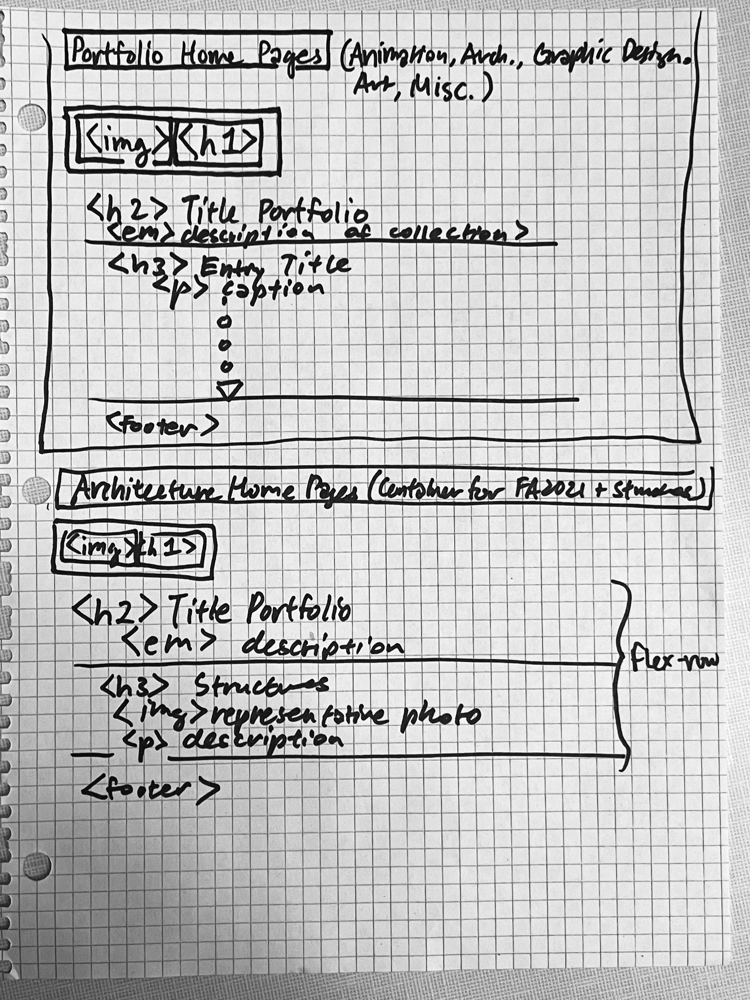
    <!-- Source: my camera-->
Each portfolio is to include an introductory description of the content being curated, with structures that are tailored to the content.
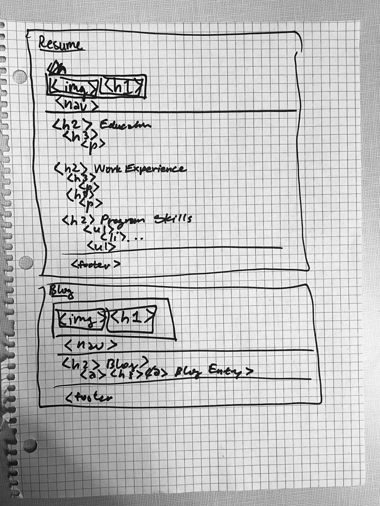
    <!-- Source: my camera-->
The resume and blog both have headers and footers. The main content is separated by an article tag.

    <!-- Source: my camera-->
The home page (in iteration 2) Should establish the site. It should have its own content (What's new?) but it shouldn't be so overpowering that the user is no longer compelled to click on the nav bar.

### Final Site Layout (Final Submission)
> Include a sketch of the final layout for each page in your site.
> Provide an explanation below each sketch.

Explanations written in each picture:
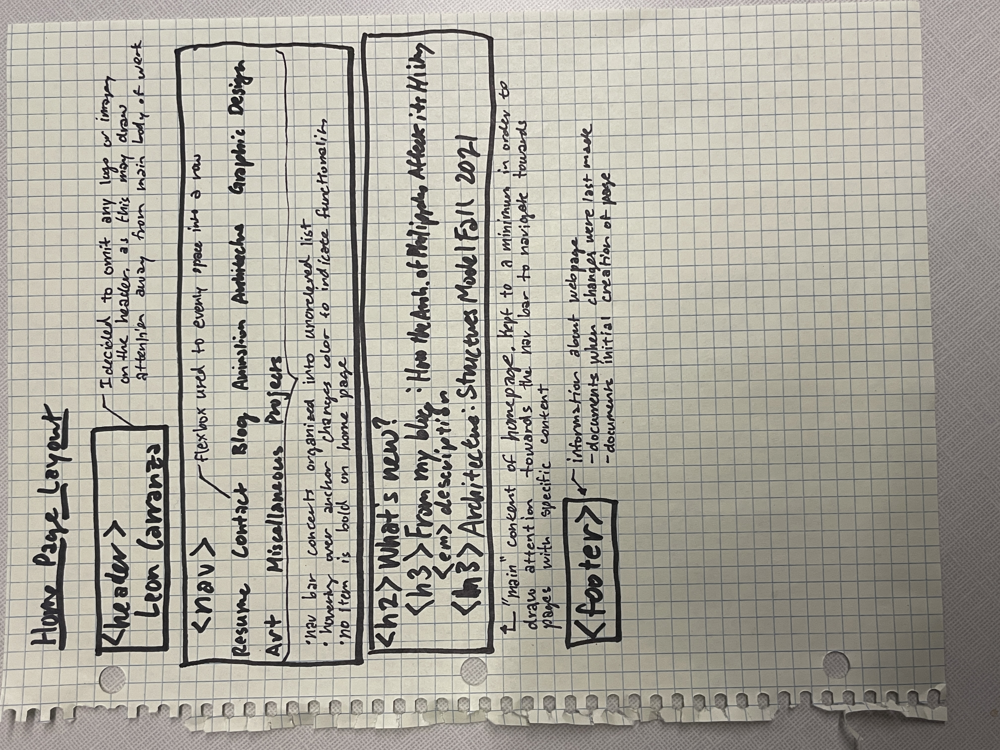
    <!-- Source: my camera-->
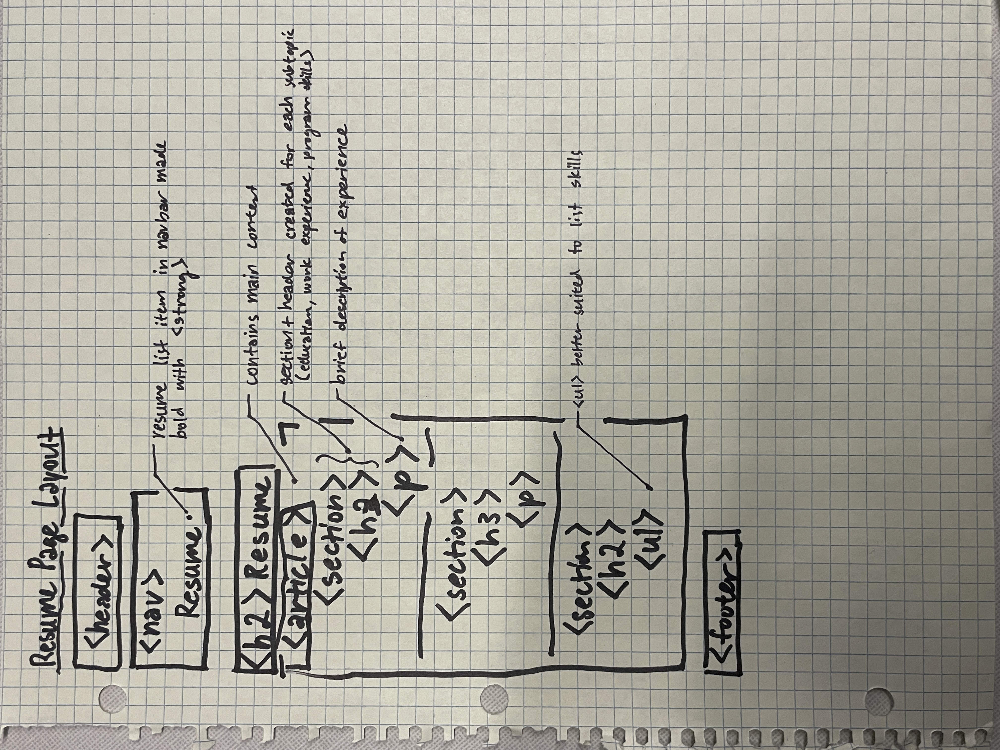
    <!-- Source: my camera-->
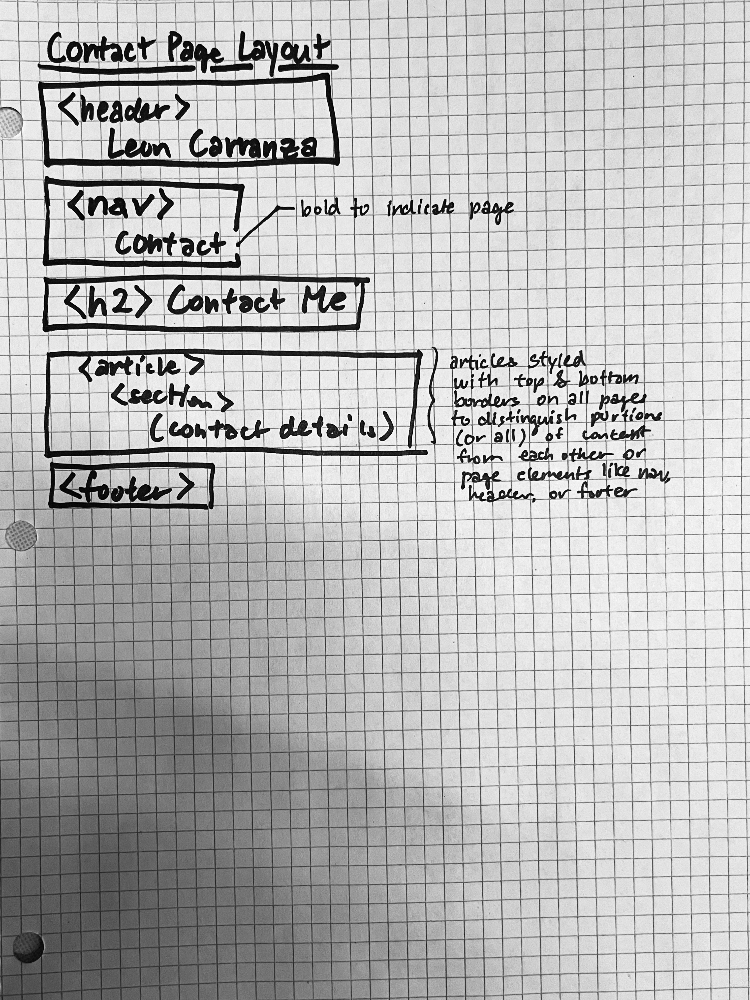
    <!-- Source: my camera-->
Blog and blog entry page grouped to show overall relationship:
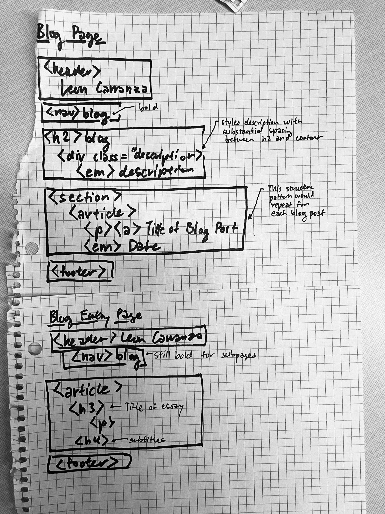
    <!-- Source: my camera-->
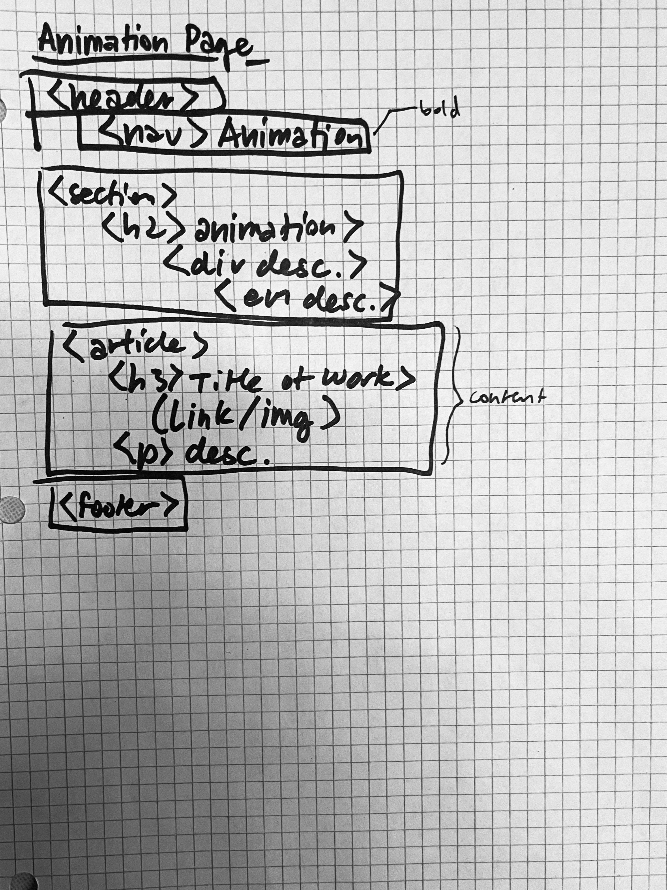
    <!-- Source: my camera-->
Architecture main and subpage sketches grouped to show overall relationship:

    <!-- Source: my camera-->
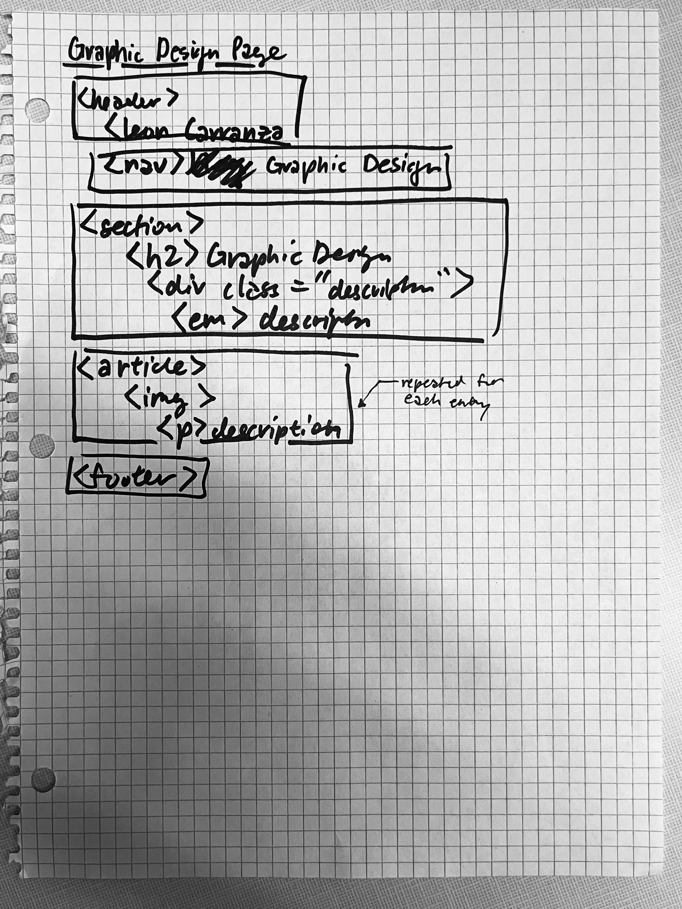
    <!-- Source: my camera-->
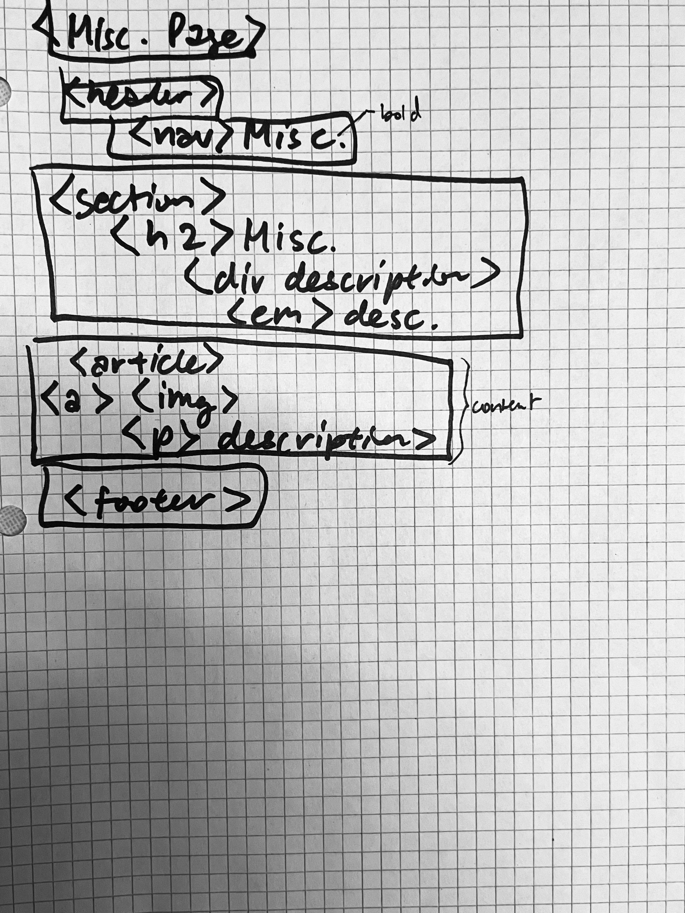
    <!-- Source: my camera-->

## Rationale (Final Submission)

**This rationale should be polished writing: one you might submit as a report to a client or boss to help explain the project and convince them you did a good job. You'll be surprised how much writing and communicating you need to do about projects and choices on internships and jobs; practice that here.**

It should be a comprehensive, complete story of the project. You might find that each section runs a few paragraphs (1-2). Sketches can often help tell the story of your design. Screenshots are also useful for describing issues discovered during the design process and how you addressed them.

**All images must be visible in Markdown Preview for credit!**

Your rationale should be a polished version of the earlier explanations.

### Audience (Final Submission)
> A complete and polished description of the intended audience(s) for your website.

The intended audience of my website includes potential employers and my peers, both in school and my job. Additionally, it is for anyone who simply wants to experience my work like a gallery, if that gives them delight. My design goal is to make this a catalogue-like experience, so it can be used as such.

### Design Goals (Final Submission)
> An explanation of the design goals for that audience, based on your earlier rationales.

My design goals were to create an organized multi-page website documenting my various works in art, architecture, marketing, and design. I have a lot of work that can be categorized by the skills I use to produce them. This allows for easy searching and navigating to particular work that may be relevant to an employer or individual from a specific field that is interested in what I have produced in the past.

### Content Organization & Navigation (Final Submission)
> An explanation of how the final content organization and navigation met your goals and why its appropriate for your audience(s).

The final content organization was based on the division of my skillsets into their uses in animation, architecture, art, graphic design, marketing, writing, and other smaller niches. Within each group, I ordered my work on a page not chronologically, but rather by what makes sense to create a coherent narrative. For example, I ordered my studio fall 2021 page to show drawings that slowly introduced my concept, then showed more in-detail documents.

### Visual Design (Final Submission)
> An explanation of how the final design met your goals and why its appropriate for your audience(s).

My final visual design entailed a layout, color scheme, and text that were very minimal. I made sure to have a dark blue text that contrasted with the off-white background. I think this combination made it more tactile, more like a catalogue, and less like a cold digital website due to the added hint of warmth from the body's background color. This established calm and simple mood allowed my varied works to take center-stage such that the website itself never distracted from the work. It's appropriate for peers, employers, or consumers of my work, who want to experience what I have produced, since the focus is solely on the work—not the website.

### Self-Reflection (Final Submission)
> What did you learn from this assignment? What are some of your strengths and weaknesses?

I learned the extent to which I can curate an experience on a portfolio website—I had made one before, with a little less knowledge of html and css, helped by a pre-made template. By cutting out this template, focusing on the content and its layout and styling in simpler terms, I learned that there's a lot of potential for bloat when making a website. Through a combination of semantics, styling strategies for accessibility, and effective structuring, I was able to make a portfolio website not only with a specific intention, but also a specific execution.

Some of the weaknesses I encountered include my insistence on including this much content for this project (more than three pages for organizing my work and information about myself). Although I could have done less, I also wanted to make sure I had a portfolio I could present to prospective employers by the end of it. However, this cut into time I could have used in order to make more coherent card-sortings, ponder different ways of organizing content, and styling with CSS.
